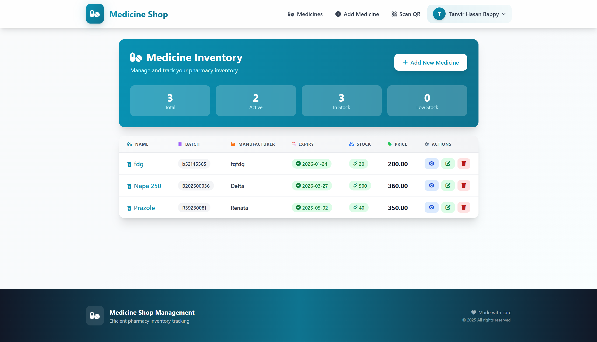
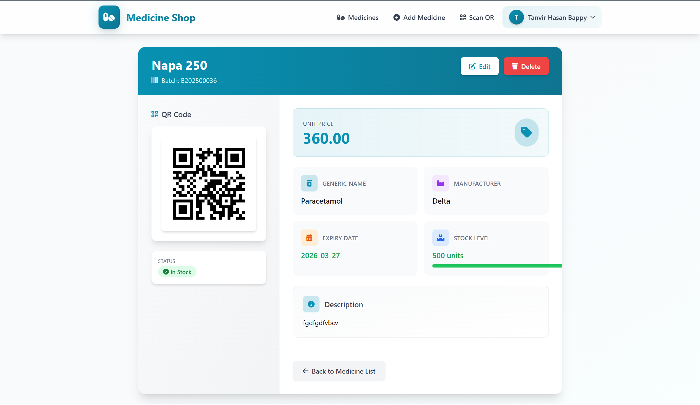
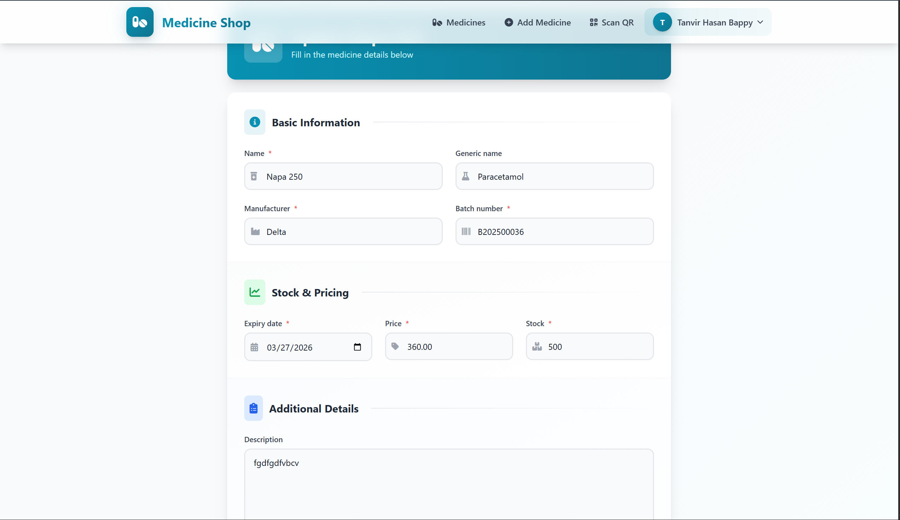
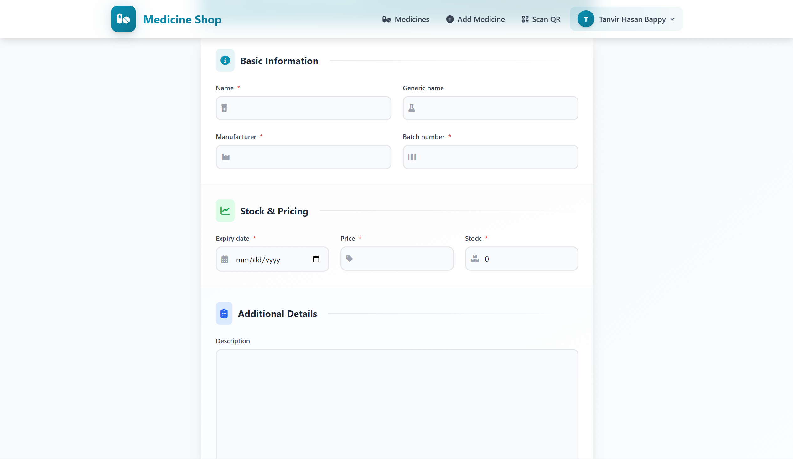
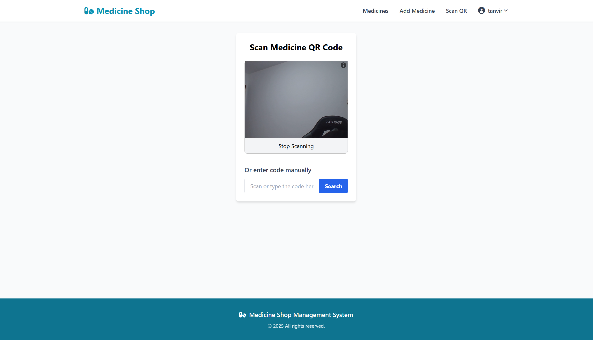

# Medicine Shop Management System

A web-based application for managing a medicine shop, built with Django and Tailwind CSS. This system allows users to track medicines, add new inventory, and scan QR codes for quick access to medicine details.

## Features

- User authentication (login/logout)
- Medicine inventory management (list, add, view details)
- QR code scanning functionality for quick medicine lookup
- Responsive design for mobile and desktop use
- Message notifications for user actions

## Tech Stack

- **Backend**: Python, Django
- **Frontend**: HTML, Tailwind CSS, Font Awesome
- **Database**: SQLite (default, can be configured to use PostgreSQL/MySQL)
- **QR Code Handling**: (Add relevant library if used, e.g., `qrcode`, `pyzbar`)

## Installation

### Prerequisites

- Python 3.8+
- pip (Python package installer)
- Virtual environment (recommended)

### Steps

1. **Clone the repository**
   ```bash
   git clone https://github.com/Tanvir-yzu/medicine_shop.git
   cd medicine_shop
   ```

2. **Create and activate a virtual environment**
   ```bash
   # Windows
   python -m venv myenv
   myenv\Scripts\activate

   # macOS/Linux
   python3 -m venv myenv
   source myenv/bin/activate
   ```

3. **Install dependencies**
   ```bash
   pip install -r requirements.txt
   ```

4. **Configure the project**
   - Create a `.env` file (optional) for environment variables like `SECRET_KEY`
   - Update `settings.py` if needed (database configuration, etc.)

5. **Run migrations**
   ```bash
   python manage.py makemigrations
   python manage.py migrate
   ```

6. **Create a superuser** (for admin access)
   ```bash
   python manage.py createsuperuser
   ```

7. **Start the development server**
   ```bash
   python manage.py runserver
   ```

8. **Access the application**
   - Open your browser and go to `http://127.0.0.1:8000/`
   - Admin panel is available at `http://127.0.0.1:8000/admin/`

## Usage

1. **Login**: Use your credentials to log in to the system
2. **Manage Medicines**:
   - View all medicines in the inventory
   - Add new medicines using the "Add Medicine" form
   - Scan QR codes to quickly access medicine details
3. **Logout**: Click "Logout" when done

## Project Structure

```
medicine_shop/
├── medicine_shop/          # Project settings directory
│   ├── __init__.py
│   ├── settings.py         # Project settings
│   ├── urls.py             # Main URL configuration
│   └── wsgi.py
├── medicines/              # Main app directory
│   ├── templates/          # HTML templates
│   │   └── medicines/
│   │       ├── base.html   # Base template
│   │       ├── medicine_list.html
│   │       └── ...
│   ├── __init__.py
│   ├── admin.py            # Admin configuration
│   ├── apps.py
│   ├── migrations/         # Database migrations
│   ├── models.py           # Data models
│   ├── urls.py             # App URL configuration
│   └── views.py            # View functions
├── manage.py               # Django management script
└── requirements.txt        # Project dependencies
```

## Contributing

1. Fork the repository
2. Create a new branch branch (`git checkout -b feature/feature-name`)
3. Make your changes
4. Commit your changes (`git commit -m 'Add some feature'`)
5. Push to the branch (`git push origin feature/feature-name`)
6. Open a Pull Request

## License

This project is licensed under the MIT License - see the [LICENSE](LICENSE) file for details.

## Acknowledgments

- [Django Documentation](https://www.djangoproject.com/) - Web framework
- [Tailwind CSS](https://tailwindcss.com/) - CSS framework
- [Font Awesome](https://fontawesome.com/) - Icon library








