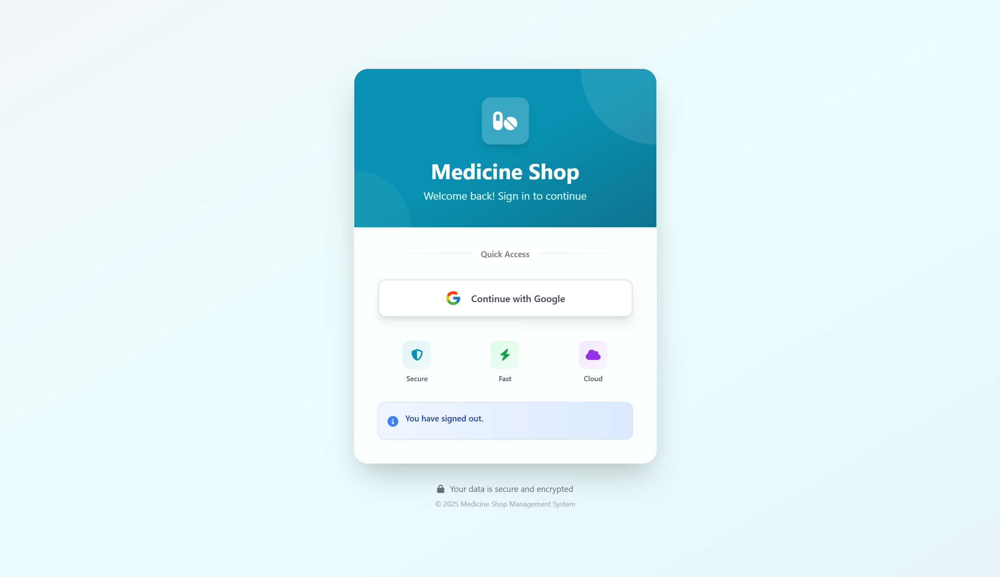

<div align="center">

# 💊 Medicine Shop Management System


A modern, web-based pharmacy inventory management system built with Django and Tailwind CSS. Features a sleek UI, QR code scanning, and comprehensive medicine tracking capabilities.

[](http://127.0.0.1:8000/)
[](#)

</div>

---

## ✨ Features

<div align="center">

### 🔐 Authentication
- Secure Google OAuth login
- User session management
- Protected routes

### 💊 Medicine Management
- Create, Read, Update, Delete (CRUD) operations
- Inventory tracking with stock alerts
- Expiry date monitoring
- Search and filter functionality

### 📱 QR Code System
- Generate QR codes for each medicine
- Scan QR codes for instant lookup
- Batch number tracking
- Fuzzy search fallback

### 🎨 Modern UI/UX
- Responsive design (mobile & desktop)
- Gradient backgrounds
- Smooth animations
- Dark mode ready
- Real-time notifications

### 📊 Dashboard
- Inventory statistics
- Low stock alerts
- Expiry warnings
- Visual data representation

</div>

---

## 🛠️ Tech Stack

| Component | Technology |
|-----------|-----------|
| **Backend** |   |
| **Frontend** |   |
| **Icons** |  |
| **Database** |  (Configurable to PostgreSQL/MySQL) |
| **QR Code** |  |
| **Search** |  |

---

## 📦 Installation

### Prerequisites

-  Python 3.8 or higher
-  pip package installer
-  (recommended)

### Quick Start

#### 1️⃣ Clone the Repository

```bash
git clone https://github.com/Tanvir-yzu/medicine_shop.git
cd medicine_shop
```

#### 2️⃣ Create Virtual Environment

<details>
<summary><b>Windows</b></summary>

```bash
python -m venv myenv
myenv\Scripts\activate
```

</details>

<details>
<summary><b>macOS / Linux</b></summary>

```bash
python3 -m venv myenv
source myenv/bin/activate
```

</details>

#### 3️⃣ Install Dependencies

```bash
pip install -r requirements.txt
```

#### 4️⃣ Configure Project

Create a `.env` file in the project root:

```env
SECRET_KEY=your-secret-key-here
DEBUG=True
ALLOWED_HOSTS=localhost,127.0.0.1
```

#### 5️⃣ Run Migrations

```bash
python manage.py makemigrations
python manage.py migrate
```

#### 6️⃣ Create Superuser

```bash
python manage.py createsuperuser
```

#### 7️⃣ Start Development Server

```bash
python manage.py runserver
```

#### 8️⃣ Access Application

- 🌐 **Main App**: [http://127.0.0.1:8000/](http://127.0.0.1:8000/)
- 🔧 **Admin Panel**: [http://127.0.0.1:8000/admin/](http://127.0.0.1:8000/admin/)

---

## 📖 Usage Guide

### Login Process

1. Visit the application URL
2. Click "Login with Google"
3. Authorize with your Google account
4. You'll be redirected to the dashboard

### Managing Medicines

| Action | Description |
|--------|-------------|
| **View Inventory** | Browse all medicines in a beautiful table layout |
| **Add Medicine** | Click "Add New Medicine" and fill out the form |
| **Scan QR Code** | Use camera to scan medicine QR codes |
| **Edit Details** | Click the edit icon to update medicine information |
| **Delete** | Remove medicines with confirmation dialog |

### Search & Filter

- Use the search bar to find medicines by name or batch number
- Fuzzy search helps find partial matches
- Real-time filtering as you type

---

## 📁 Project Structure

```
medicine_shop/
├── 📂 medicine_shop/          # Project configuration
│   ├── 📄 __init__.py
│   ├── ⚙️ settings.py         # Django settings
│   ├── 🌐 urls.py             # Main URL routes
│   └── 🚀 wsgi.py            # WSGI config
│
├── 📂 medicines/              # Main application
│   ├── 📂 templates/          # HTML templates
│   │   └── 📂 medicines/
│   │       ├── 🎨 base.html           # Base template
│   │       ├── 📋 medicine_list.html
│   │       ├── 📄 medicine_detail.html
│   │       ├── ➕ medicine_form.html
│   │       ├── 📷 scan_medicine.html
│   │       └── 🗑️ medicine_confirm_delete.html
│   ├── 📄 __init__.py
│   ├── 👤 admin.py            # Admin configuration
│   ├── 📱 apps.py
│   ├── 📂 migrations/         # Database migrations
│   ├── 🗃️ models.py           # Data models
│   ├── 🌐 urls.py             # App URL configuration
│   └── 🎮 views.py            # View logic
│
├── 📂 user/                   # User authentication app
│   ├── 📂 templates/
│   │   └── 📂 user/
│   │       └── 🔐 login.html
│   └── ...other files...
│
├── 📄 manage.py               # Django CLI
├── 📦 requirements.txt        # Dependencies
├── 📸 Photo/                  # Screenshots
└── 📖 README.md               # This file
```

---

## 🎨 Screenshots

### 🏠 Main Application

<div align="center">


</div>

### 🔧 Admin Dashboard

<div align="center">




</div>

---

## 🤝 Contributing

We welcome contributions! Here's how you can help:

1. 🍴 **Fork** the repository
2. 🌿 **Create** a new branch (`git checkout -b feature/AmazingFeature`)
3. 💾 **Commit** your changes (`git commit -m 'Add some AmazingFeature'`)
4. 📤 **Push** to the branch (`git push origin feature/AmazingFeature`)
5. 🔀 **Open** a Pull Request

### Development Guidelines

- Follow PEP 8 style guidelines
- Write meaningful commit messages
- Add tests for new features
- Update documentation

---

## 📜 License

This project is licensed under the MIT License - see the [LICENSE](LICENSE) file for details.

```
MIT License

Copyright (c) 2025 Medicine Shop Management System

Permission is hereby granted, free of charge, to any person obtaining a copy
of this software and associated documentation files (the "Software"), to deal
in the Software without restriction...
```

---

## 🙏 Acknowledgments

- [](https://www.djangoproject.com/) The web framework for perfectionists with deadlines
- [](https://tailwindcss.com/) Rapidly build modern websites without leaving your HTML
- [](https://fontawesome.com/) The internet's icon library
- [](https://github.com/mebjas/html5-qrcode) A cross-browser QR code scanning library

---

<div align="center">

## ⭐ Star This Project!

If you find this project helpful, please consider giving it a ⭐ star on GitHub!

[](https://github.com/Tanvir-yzu/medicine_shop/stargazers)

---

Made with ❤️ by [Tanvir](https://github.com/Tanvir-yzu)

</div>
